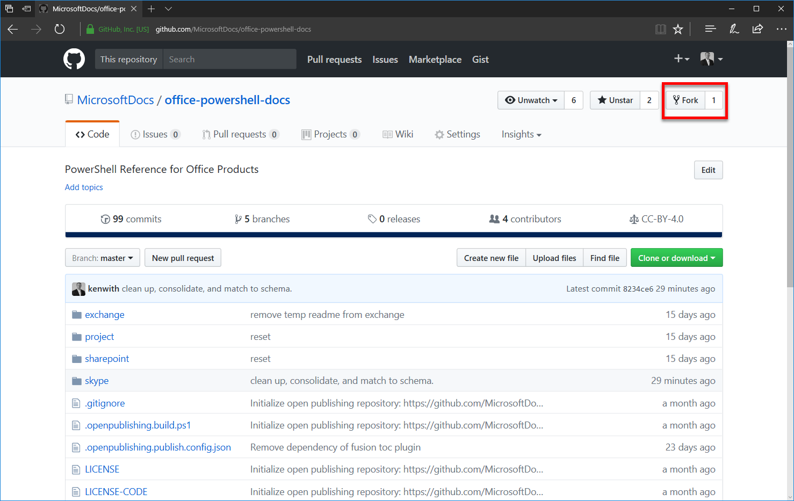
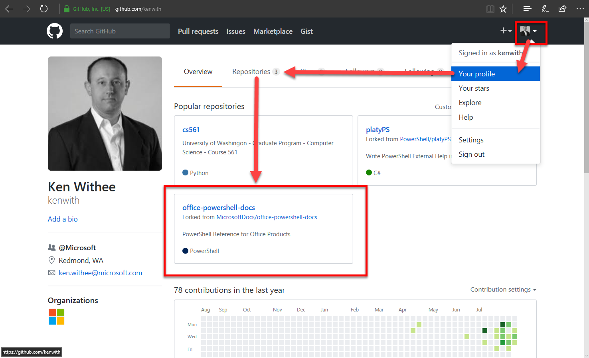

A repository to hold the help reference content for Office PowerShell cmdlets.


# Learn How To Contribute
Anyone who is interested can contribute to the Microsoft Office PowerShell reference topics. 
When you contribute your work will go directly into the Microsoft Office products and show up in Get-Help for the given Office cmdlet.

## Steps in a nutshell
1. Fork Office PowerShell repo to your own account.
2. Clone your repo to your local development computer.
```
git clone [URL to your forked repo]
```
3. Keep your forked repo up-to-date with upstream repo.
```
git remote add upstream https://github.com/MicrosoftDocs/office-powershell-docs.git 
```
```
git fetch upstream
```
4. Create your own working branch.
```
git checkout -b [name of your branch]
```
5. Work on content in your favorite Markdown editor.
6. Test to make sure your work matches the correct schema (use PlatyPS tool for this).
7. Merge the Master branch with your working branch (in your forked repo) and resolve any issues.
```
git merge master [name of your branch]
```
8. Submit a Pull Request to move your work upstream.

## Steps in more detail

### Sign In or Join GitHub
To sign in to GitHub, point your web browser to https://github.com/login.

To join GitHub for the first time, point your web browser to
https://github.com/join.

It is highly recommended to turn on two-factor authentication for security, see
https://help.github.com/articles/about-two-factor-authentication/. 

### Fork the GitHub repository into your own account

Fork the GitHub project into your own account so you have a place to work on it.
To Fork the project, point your web browser to the repository at
https://github.com/MicrosoftDocs/office-powershell-docs 
and then click the Fork button on the upper right corner of the repository page as shown in screenshot.



You now have your very own copy (fork) of the main Office PowerShell repository. You can see it by clicking on your profile drop-down in the upper right of the page and choosing Your Profile and then clicking the Repositories tab of your GitHub account as shown in the diagram. 



Your repository is an exact copy of the original Office PowerShell repository and is located in your GitHub account. 
In GitHub terms the main Office PowerShell repository is the Upstream repository and your forked version is the Downstream repository.

You can update your repository with the Upstream repository at any time and it is recommended to do this fairly often so that your fork doesn't get out of sync with the original. 
The next section covers cloning and updating your repo with the upstream repo.

### Clone your Fork to your local development machine
Now that you have your own copy of the repository on GitHub the next step is to get the actual files on your local computer so you can work with them. 
To do this you clone your GitHub repository to your local computer. Here is a diagram:


Tip: You can clone your repository to muliple computers if you choose. 
You just have to make sure you save your local work by pushing it back up to your repository.
And vice versa, when you start workign on a new computer you have to remember to pull any changes down to your local work computer. 
This will be described in more detail later on.

There are many tools that can be used to work with GitHub. 
This example uses Visual Studio Code but use whatever you prefer.
The concepts are the same. Visual Studio Code is available for 
**Windows, Linux, and Mac**.
You can find it here: 
https://code.visualstudio.com/

If you have Git Bash installed you can get to it from within Visual Studio Code by pressing 
**Control-`** (control-backtick key which is to the left of number 1).

Using Visual Studio Code and Git Bash you can clone a repository as follows:
```
git clone [URL to your forked repo]
```

For example, `git clone https://github.com/kenwith/office-powershell-docs.git`

Note that in this example my user is 
**kenwith**
so I need to make sure I am cloning the Fork I created and not the upstream original. 
The user is in the URL for the GitHub repo.

Once you have cloned your repository you can use git push and git pull to push and pull your changes up to your repository.
It is best to use your own working branch so this will be covered in the next section.

To update your copy of the repo with the upstream copy you first need to add a remote origin and then fetch the upstream branch. 
There are many ways to do this but one way is to use Git Bash as follows:
```
git remote add upstream https://github.com/MicrosoftDocs/office-powershell-docs.git 
```
```
git fetch upstream
```

For more details, see:
- https://help.github.com/articles/configuring-a-remote-for-a-fork/
- https://help.github.com/articles/syncing-a-fork/

### Create and checkout a branch for your work
The next step is to create your own working branch. 
The reason for this is so that you can pull updates from the Master branch from the upstream repository and merge your own working branch in your own Fork. 
This way you can be sure when you do a Pull Request that you won't be conflicting with edits that have happened since you forked the project.

In the Git Bash terminal in Visual Studio Code:
```
git checkout -b [name of your branch]
```

### Make edits to the relevant PowerShell cmdlet markdown.

Open your favorite Markdown editor and edit the Markdown in your working branch. 
Tip: Visual Studio Code provides a nice side-by-side view for editing Markdown content. 
One side will show the Markdown source and the other side will show a preview of how the Markdown will render. 
You can find this view by clicking the small icon in the upper right of Visual Studio Code that looks like a side by side view with a magnifying glass.

Some important notes when editing Markdown:

Since GitHub is a source control system and marks edits on a per-line basis it is important to have each sentence, or concept, on its own line. 
Markdown will still show paragraphs with each sentence on its own line. 
To break into another paragraph add a blank line in between the paragraphs. 
Here is a great article that describes this writing system:
http://rhodesmill.org/brandon/2012/one-sentence-per-line/ 

Learn how to write good Markdown (which is a type of Markup language):
https://guides.github.com/features/mastering-markdown/

More about writing content for GitHub:
https://help.github.com/categories/writing-on-github/ 

You can find the schema that the content should follow here:
https://github.com/PowerShell/platyPS/blob/master/platyPS.schema.md


### Test to make sure the markdown matches the schema
**SECTION IN PROGRESS**

All edits to Markdown files for cmdlets MUST follow this schema:
https://github.com/PowerShell/platyPS/blob/master/platyPS.schema.md
Any deviations will break Get-Help. 

How to run the command to generate XML and validate you have matched the schema and won't cause errors in build. 
To validate run the New-ExternalHelp command (from PlatyPS) on your Markdown.

### Merge the upstream Master branch into your branch
Merge the Master branch with your working branch (in your forked repo) and resolve any issues.
https://git-scm.com/book/en/v2/Git-Branching-Basic-Branching-and-Merging

It is best practice to merge the Master branch from upstream with your working branch and not vice versa.
Then you can submit a Pull Request for your working branch and the upstream repo maintainer can merge your branch into Master without issues.

Make sure that you have your working branch checked out and that your forked repo is updated with the upstream Master branch.
See the section on forking above for details.

Merge the Master branch with your working branch and then resolve issues.
```
git merge master [name of your branch]
```

### Create a Pull Request
To get your work back into the upstream repo you create a Pull Request.
A Pull Request asks the maintainers of the upstream repo to pull your work into the main project.

1. To create a Pull Request, Open your web browser and navigate to the main upstream repo site at:
https://github.com/MicrosoftDocs/office-powershell-docs
2. Click the New Pull Request button towards the top of the page.
3. Click the link to "compare across forks".
4. Select the upstream branch and your local branch.
5. Click Create Pull Request.

The repo maintainers will be notified of your Pull Request.
Your Pull Request will have its own page where you can discuss and modify your request if required.


## Confirm your work shows up on docs.microsoft.com
Once your Pull Request is approved and your branch merged into Master your changes will show on 
docs.microsoft.com, here: 
**need link**

Your work will also show up in the Office products themselves when a user types Get-Help for the cmdlets that you worked on.

### Congratulations are in order!
You just joined an elite club of contributors to Microsoft Office documentation!
Your edits will be pulled into the product and show up under Get-Help when someone is viewing reference content for the cmdlet you edited. 
See your status here:
https://github.com/MicrosoftDocs/office-powershell-docs/graphs/contributors

Don't forget to ~~brag~~ share on social media! 
Sharing helps sustain the community and advertises to others to contribute to the open source content as well!


# Generate Your Own Markdown
**SECTION IN PROGRESS**

## Install PlatyPS.
**SECTION IN PROGRESS**

## Get to where you can run Get-Help and see cmdlets.
**SECTION IN PROGRESS**

## Generate help with PlatyPS.
**SECTION IN PROGRESS**

## If you want to merge multiple versions into a single version then use the PlatyPS merge command.
**SECTION IN PROGRESS**