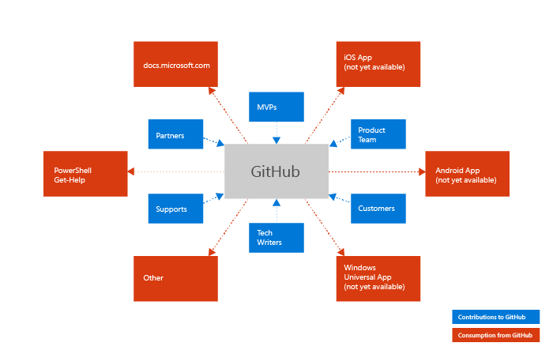
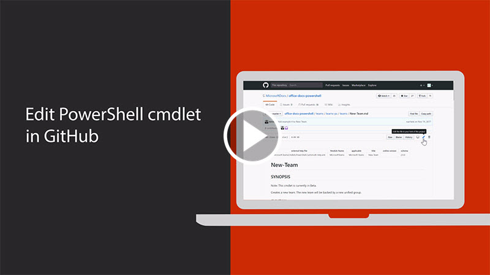

# Short URL: aka.ms/office-powershell

# Overview
A repository to hold the help reference content for Office PowerShell cmdlets. The expert knowledge around Office PowerShell is distributed among customers, MVPs, partners, product teams, support, and other community members. Consumers also have various preferences when consuming knowledge such as a website, PowerShell Get-Help, Windows app, iOS app, Android app, and others. The following diagram illustrates the point.

# Learn How To Contribute
Anyone who is interested can contribute to the Microsoft Office PowerShell reference topics.
When you contribute your work will go directly into the Microsoft Office products and show up in Get-Help for the given Office cmdlet.

> Notice that if you are looking into contributing for the **PnP PowerShell cmdlets**, their documentation is automatically generated from the code, and you should be submitting your change towards the original code at https://github.com/SharePoint/PnP-powershell. See, for example, how the attributes are used in the code for the [Get-PnPList](https://github.com/SharePoint/PnP-PowerShell/blob/master/Commands/Lists/GetList.cs) cmdlet.

# Quick Start

## Contribute using the GitHub website

1. Open your browser, log in to GitHub, and then navigate to https://github.com/microsoftdocs/office-docs-powershell
2. Browse to the file you want to edit. In this example, we will edit https://github.com/MicrosoftDocs/office-docs-powershell/blob/master/teams/teams-ps/teams/New-Team.md and add a link in the Related Links section.
3. Click the Edit icon which looks like a pencil in the upper right corner. 

4. Your browser will then open the file in an edit window. We want to add a link. So we scroll down to the Related Links section and add the link in the correct format.

**Note** Since you are likely not a maintainer of the Git repository, GitHub will automatically 'Fork' the project into your personal GitHub account. A fork is just an exact copy of the repository in your own account so that you have total access to make edits. You are now 'editing' a copy of the project in your own GitHub account. You can always find it again by looking at your GitHub Repositories in your GitHub Profile (drop-down from your name in the top right).

5. You can click the Preview changes link to see what the changes will look like.

   **IMPORTANT** The layout of headings and subheadings must follow a very specific schema that is required for PowerShell Get-Help.
   Any deviation will throw errors in the Pull Request. The schema can be found here: https://github.com/PowerShell/platyPS/blob/master/platyPS.schema.md 

6. Once you are satisfied with your work, go to the **Propose file change** area at the bottom of the topic. Enter a title and other description information, and then click **Propose file change**.

7. On the next screen, click **Create pull request**.

Looking for more in-depth content? Check out the following:
* [Frequently Asked Questions (FAQ)](repo_docs/FAQ.md)
* [Using more advanced tools with the PowerShell GitHub repo](repo_docs/ADVANCED.md)
* [Creating content for brand new cmdlets](repo_docs/NEW_CMDLETS.md)

# Microsoft Open Source Code of Conduct

## Contributing

This project welcomes contributions and suggestions. Most contributions require you to agree to a
Contributor License Agreement (CLA) declaring that you have the right to, and actually do, grant us
the rights to use your contribution. For details, visit https://cla.microsoft.com.

When you submit a pull request, a CLA-bot will automatically determine whether you need to provide
a CLA and decorate the PR appropriately (e.g., label, comment). Simply follow the instructions
provided by the bot. You will only need to do this once across all repos using our CLA.

This project has adopted the [Microsoft Open Source Code of Conduct](https://opensource.microsoft.com/codeofconduct/).
For more information see the [Code of Conduct FAQ](https://opensource.microsoft.com/codeofconduct/faq/) or
contact [opencode@microsoft.com](mailto:opencode@microsoft.com) with any additional questions or comments.

## Legal Notices

Microsoft and any contributors grant you a license to the Microsoft documentation and other content
in this repository under the [Creative Commons Attribution 4.0 International Public License](https://creativecommons.org/licenses/by/4.0/legalcode),
see the [LICENSE](LICENSE) file, and grant you a license to any code in the repository under the [MIT License](https://opensource.org/licenses/MIT), see the
[LICENSE-CODE](LICENSE-CODE) file.

Microsoft, Windows, Microsoft Azure and/or other Microsoft products and services referenced in the documentation
may be either trademarks or registered trademarks of Microsoft in the United States and/or other countries.
The licenses for this project do not grant you rights to use any Microsoft names, logos, or trademarks.
Microsoft's general trademark guidelines can be found at http://go.microsoft.com/fwlink/?LinkID=254653.

Privacy information can be found at https://privacy.microsoft.com/en-us/

Microsoft and any contributors reserve all others rights, whether under their respective copyrights, patents,
or trademarks, whether by implication, estoppel or otherwise.
