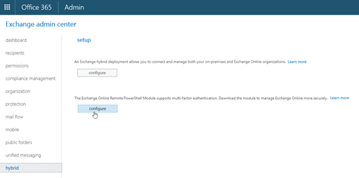
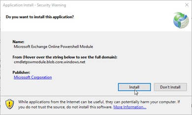
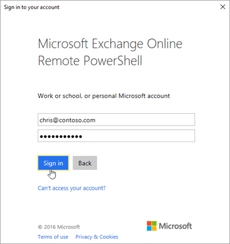
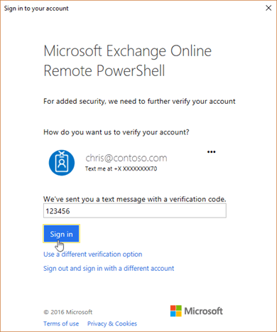

# Connect to Exchange Online PowerShell using multi-factor authentication
If you want to use multi-factor authentication (MFA) to connect to Exchange Online PowerShell, you can't use the instructions at [Connect to Exchange Online PowerShell](connect-to-exchange-online-powershell.md) to use remote PowerShell to connect to Exchange Online. MFA requires you to install the Exchange Online Remote PowerShell Module, and use the **Connect-EXOPSSession** cmdlet to connect.
  
> [!NOTE]
> You can't use the Exchange Online Remote PowerShell Module to connect to Exchange Online PowerShell and Security &amp; Compliance Center PowerShell in the same session (window). You need to use separate sessions of the Exchange Online Remote PowerShell Module. 
  
## What do you need to know before you begin?

- Estimated time to complete: 5 minutes
    
- The Exchange Online Remote PowerShell Module needs to be installed on your computer:
    
1. In Internet Explorer or Edge, open the Exchange admin center (EAC) for your Exchange Online organization (Google Chrome or Mozilla Firefox won't work). For instructions, see [Exchange Admin Center in Exchange Online](http://technet.microsoft.com/library/ace44f6b-4084-4f9c-89b3-e0317962472b.aspx).
    
2. In the EAC, go to **Hybrid** > **Setup** and click the appropriate **Configure** button to download the Exchange Online Remote PowerShell Module for multi-factor authentication.
    
     
  
3. In the **Application Install** window that opens, click **Install**.
    
     
  
- Windows Remote Management (WinRM) on your computer needs to allow basic authentication (it's enabled by default). To verify that basic authentication is enabled, run this command in a Command Prompt:
    
  ```
  winrm get winrm/config/client/auth
  ```

    If you don't see the value  `Basic = true`, you need to run this command to enable basic authentication for WinRM:
    
  ```
  winrm set winrm/config/client/auth @{Basic="true"}
  ```

    If basic authentication is disabled, you'll get this error when you try to connect:
    
     `The WinRM client cannot process the request. Basic authentication is currently disabled in the client configuration. Change the client configuration and try the request again.`

- When you use the Exchange Online Remote PowerShell Module, your session will end after one hour, which can be problematic for long-running scripts or processes. To avoid this issue, use [Trusted IPs](https://docs.microsoft.com/azure/active-directory/authentication/howto-mfa-mfasettings#trusted-ips) to bypass MFA for connections from your intranet. Trusted IPs allow you to connect to Exchange Online PowerShell from your intranet using the old instructions at [Connect to Exchange Online PowerShell](connect-to-exchange-online-powershell.md). Also, if you have servers in a datacenter, be sure to add their public IP addresses to Trusted IPs as described [here](https://docs.microsoft.com/azure/active-directory/authentication/howto-mfa-mfasettings#enable-the-trusted-ips-feature-by-using-service-settings).

> [!TIP]
> Having problems? Ask for help in the Exchange forums. Visit the forums at: [Exchange Online](https://go.microsoft.com/fwlink/p/?linkId=267542), or [Exchange Online Protection](https://go.microsoft.com/fwlink/p/?linkId=285351). 
  
## Connect to Exchange Online PowerShell by using MFA

1. On your local computer, open the **Exchange Online Remote PowerShell Module** ( **Microsoft Corporation** > **Microsoft Exchange Online Remote PowerShell Module**).
    
2. The command that you need to run uses the following syntax:
    
  ```
  Connect-EXOPSSession -UserPrincipalName <UPN> [-ConnectionUri <ConnectionUri> -AzureADAuthorizationEndPointUri <AzureADUri>]
  ```

  -  _\<UPN\>_ is your Office 365 work or school account.
    
  - The  _\<ConnectionUri\>_ and _\<AzureADUri\>_ values depend on the location of your Office 365 organization as described in the following table:
    
   |**Office 365 offering**|**_ConnectionUri_ parameter value**|**_AzureADAuthorizationEndPointUri_ parameter value**|
   |:-----|:-----|:-----|
   |Office 365|Not used|Not used|
   |Office 365 Germany|`https://outlook.office.de/PowerShell-LiveID`|`https://login.microsoftonline.de/common`|
   
   This example connects to Exchange Online in Office 365 using the account chris@contoso.com.
    
   ```    
   Connect-EXOPSSession -UserPrincipalName chris@contoso.com
   ```

   This example connects to Exchange Online in Office 365 Germany using the account lukas@fabrikam.com.
    
   ```
   Connect-EXOPSSession -UserPrincipalName lukas@fabrikam.com -ConnectionUri https://outlook.office.de/PowerShell-LiveID -AzureADAuthorizationEndPointUri https://login.microsoftonline.de/common
   ```

3. In the sign-in window that opens, enter your password, and then click **Sign in**.
    
     
  
    A verification code is generated and delivered based on the verification response option that's configured for your account (for example, a text message or the Azure Authenticator app on your mobile phone).
    
4. In the verification window that opens, enter the verification code, and then click **Sign in**.
    
     

> [!NOTE]
> Be sure to disconnect the remote PowerShell session when you're finished. If you close the Exchange Online Remote PowerShell Module window without disconnecting the session, you could use up all the remote PowerShell sessions available to you, and you'll need to wait for the sessions to expire. To disconnect all currently open PowerShell sessions in the current window, run the following command:

  ```
  Get-PSSession | Remove-PSSession
  ```

## How do you know this worked?

After Step 4, the Exchange Online cmdlets are imported into your Exchange Online Remote PowerShell Module session and tracked by a progress bar. If you don't receive any errors, you connected successfully. A quick test is to run an Exchange Online cmdlet, for example, **Get-Mailbox**, and see the results.
  
If you receive errors, check the following requirements:
  
- To help prevent denial-of-service (DoS) attacks, you're limited to three open remote PowerShell connections to your Exchange Online organization.
    
- The account you use to connect to Exchange Online must be enabled for remote PowerShell. For more information, see [Enable or disable access to Exchange Online PowerShell](../disable-access-to-exchange-online-powershell.md).
    
- TCP port 80 traffic needs to be open between your local computer and Office 365. It's probably open, but it's something to consider if your organization has a restrictive Internet access policy.
